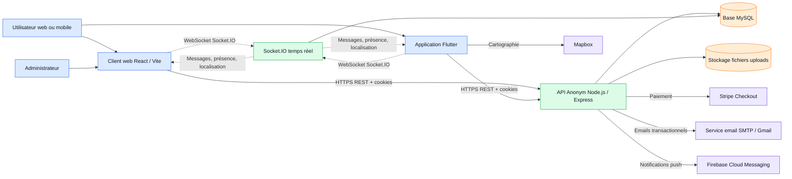
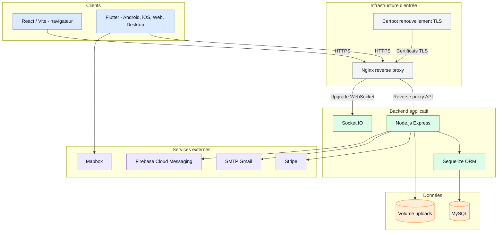
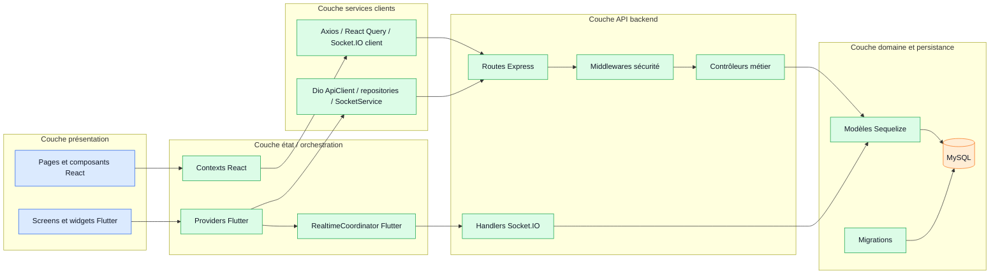
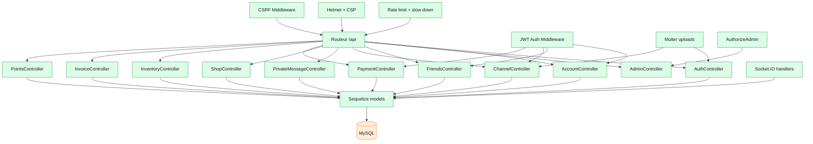
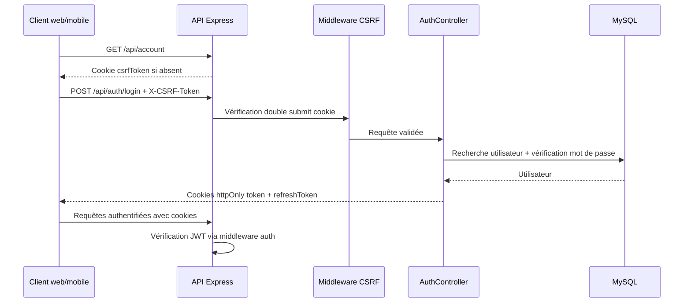
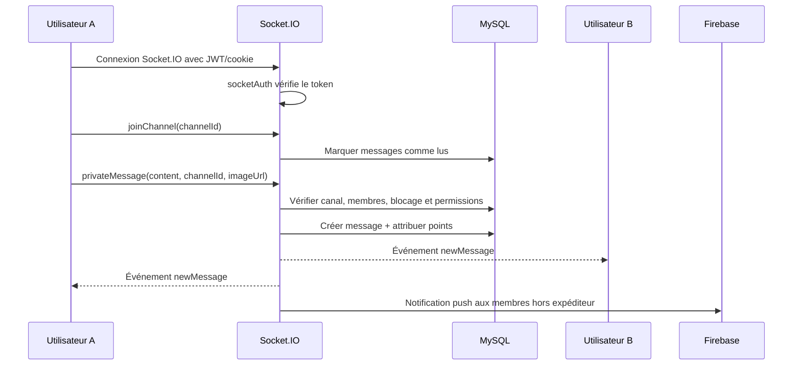
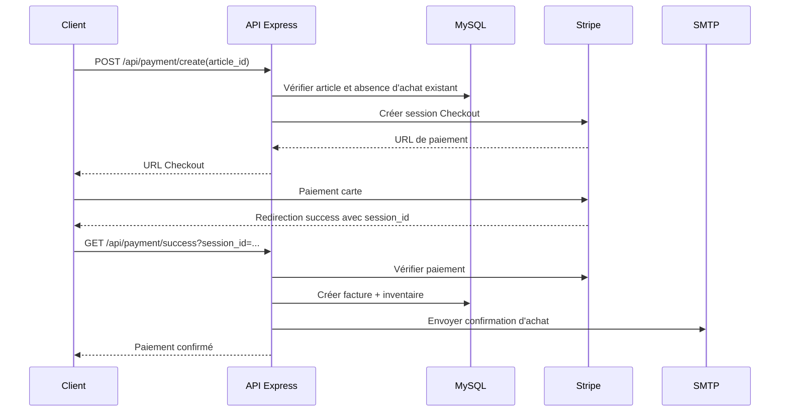
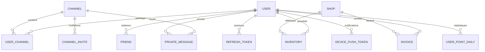
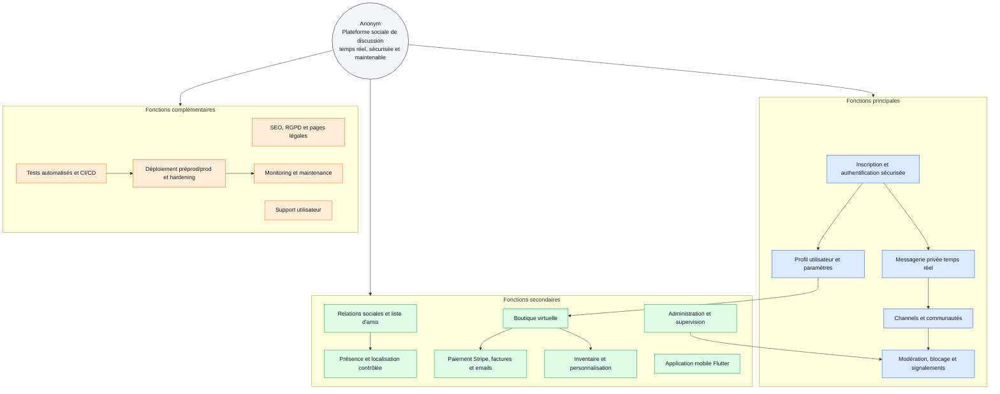
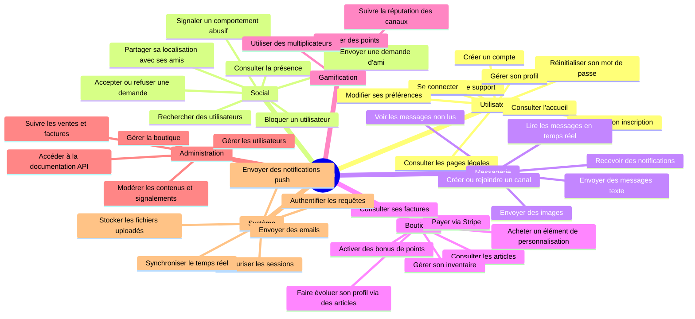

# Architecture logicielle proposée - Anonym

## 1. Objectif du document

Ce document formalise l'architecture logicielle du projet Anonym dans le cadre de l'activité A1.5 et de la compétence C1.5.

Anonym est une application de réseau social et de messagerie dont les objectifs principaux sont :

- permettre l'inscription, la connexion et la gestion de profil des utilisateurs ;
- proposer une messagerie privée et des canaux de discussion en temps réel ;
- gérer les relations sociales, la présence et la géolocalisation partagée entre amis ;
- intégrer une boutique, un inventaire, un système de points et des paiements ;
- fournir une expérience sans publicité intrusive, centrée sur la confidentialité ;
- préserver la sécurité, la maintenabilité, l'extensibilité et la sobriété de la solution.

## 2. Alignement avec le cahier des charges

Le cahier des charges positionne Anonym comme une plateforme de communication sécurisée, sans publicité intrusive, orientée protection des données personnelles et personnalisation des profils via des éléments virtuels. L'architecture logicielle proposée doit donc répondre à la fois aux besoins fonctionnels, aux contraintes de production et aux exigences de confiance attendues par les utilisateurs.

| Élément du cahier des charges | Réponse architecturale proposée |
| --- | --- |
| Application de discussion sécurisée | API Express sécurisée, authentification JWT, cookies, CSRF, Socket.IO authentifié |
| Protection des données personnelles | HTTPS, CORS contrôlé, Helmet, rôles, stockage des secrets par variables d'environnement |
| Messagerie privée | Canaux privés, messages temps réel, contrôles d'appartenance, blocage et permissions |
| Communautés et groupes | Modèle `Channel`, participants `UserChannel`, invitations et réputation |
| Boutique virtuelle | Modules `Shop`, `Inventory`, `Invoice`, paiement Stripe et emails de confirmation |
| Espace utilisateur | Profil, avatar, paramètres, préférences, inventaire et factures |
| Back-office | Interface d'administration React, rôles administrateurs, gestion utilisateurs/boutique |
| Signalement et modération | Route de signalement, blocage utilisateur, supervision administrateur |
| Responsive et mobile | Client web React responsive et application Flutter multi-plateforme |
| SEO, RGPD et accessibilité | Pages publiques, mentions légales, politique de confidentialité, support et conformité |
| Préproduction et production | Docker Compose, Nginx, Certbot, environnements séparés |
| Suivi Agile | Découpage compatible backlog, sprints et planning Gantt ClickUp |

### Périmètre fonctionnel retenu

Le périmètre couvert par l'architecture actuelle comprend l'authentification, les profils, la messagerie, les communautés, les relations sociales, la boutique, l'inventaire, les paiements, l'administration, les notifications, le support et la sécurité. Les éléments comme le multilingue complet, les dons ou certains contenus vidéo sont identifiés comme extensions possibles, car ils ne structurent pas le coeur de l'architecture actuelle mais peuvent être ajoutés sans remise en cause majeure.

## 3. Choix de modélisation

La modélisation retenue combine :

- le modèle C4 pour représenter les niveaux d'architecture : contexte, conteneurs, composants et déploiement ;
- des diagrammes de séquence UML pour expliciter les interactions dynamiques ;
- une vue logique orientée couches pour faciliter le développement, les évolutions et la maintenance.

Ce choix est justifié car le projet repose sur plusieurs clients, une API centrale, une base de données, du temps réel et des services externes. Le modèle C4 rend lisibles les responsabilités des blocs techniques pour les parties prenantes non techniques, tandis que les séquences UML décrivent précisément les flux sensibles comme l'authentification, la messagerie et le paiement.

## 4. Légende commune des schémas

| Élément | Signification |
| --- | --- |
| Rectangle bleu | Application cliente utilisée par un utilisateur ou un administrateur |
| Rectangle vert | Service applicatif interne contrôlé par l'équipe projet |
| Cylindre orange | Stockage persistant |
| Rectangle violet | Service externe tiers |
| Rectangle gris | Infrastructure de déploiement |
| Flèche pleine | Appel synchrone HTTP/HTTPS |
| Flèche pointillée | Communication asynchrone ou événement temps réel |
| Flèche rouge | Flux nécessitant un contrôle de sécurité renforcé |
| Position gauche | Acteurs et interfaces clientes |
| Position centrale | Coeur applicatif et règles métier |
| Position droite | Données, fichiers et systèmes externes |

## 5. Vue contexte du système

### Interactions explicitées

- Les utilisateurs accèdent à Anonym depuis le client web React ou l'application Flutter.
- Les administrateurs utilisent le client web pour la gestion des utilisateurs, de la boutique et de la documentation API.
- Les clients appellent l'API Express en HTTPS pour les opérations métier.
- Les clients ouvrent une connexion Socket.IO authentifiée pour les messages, la présence et la localisation live.
- L'API persiste les données dans MySQL via Sequelize.
- Les fichiers utilisateurs et images de messages sont stockés dans le dossier `uploads`.
- Stripe gère la création et la validation des sessions de paiement.
- Nodemailer envoie les emails de confirmation, reset password, inscription et facturation.
- Firebase Cloud Messaging envoie les notifications push.
- Mapbox est utilisé côté Flutter pour les vues cartographiques.

## 6. Vue conteneurs et déploiement

### Adaptation à l'infrastructure

L'infrastructure de production est dockerisée :

- un conteneur `frontend` sert l'application React ;
- un conteneur `backend` exécute l'API Express et Socket.IO ;
- un conteneur `mysql-db` héberge la base MySQL avec volume persistant ;
- un conteneur `nginx` joue le rôle de reverse proxy HTTPS ;
- un conteneur `certbot` renouvelle les certificats TLS ;
- un réseau Docker dédié isole les échanges internes.

Cette architecture est adaptée à la production car elle sépare les responsabilités, facilite les déploiements, permet de remplacer chaque conteneur indépendamment et limite l'exposition directe de la base de données.

## 7. Architecture logique en couches

### Responsabilités par couche

| Couche | Responsabilité | Exemples du projet |
| --- | --- | --- |
| Présentation | Affichage et interaction utilisateur | pages React, screens Flutter, widgets |
| État / orchestration | Gestion de session, état métier, synchronisation UI | Context React, Provider Flutter, AppProvider |
| Services clients | Appels API, cookies, refresh session, sockets | Axios, Dio, SocketService |
| API backend | Routage, validation, sécurité, orchestration métier | routes auth, account, shop, channels, payment |
| Domaine / persistance | Modèles, transactions, relations, migrations | User, Friend, Channel, PrivateMessage, Invoice |

Cette séparation rend l'architecture maintenable : les évolutions UI, métier, temps réel et persistance peuvent être traitées dans des zones identifiées.

## 8. Composants backend

### Modules métier identifiés

- Authentification : inscription, code de vérification, connexion, refresh token, logout, reset password.
- Compte : profil, mot de passe, préférences de messagerie.
- Administration : gestion des utilisateurs, boutique, documentation Swagger.
- Social : amis, demandes, blocage.
- Canaux et messages : groupes, messages privés, images, invitations, réputation.
- Présence et localisation : statut utilisateur, localisation live entre amis.
- Boutique : articles, inventaire, factures, points et multiplicateurs.
- Paiement : création de session Stripe, validation du paiement, création de facture et inventaire.

## 9. Diagramme de séquence - authentification sécurisée

### Points de sécurité

- Les tokens JWT sont portés par cookies, avec cookies `httpOnly` pour limiter l'exposition aux scripts.
- Les routes sensibles utilisent un jeton CSRF transmis dans un cookie séparé et dans l'en-tête `X-CSRF-Token`.
- Les origines CORS sont contrôlées selon l'environnement.
- Helmet et une Content Security Policy réduisent les risques XSS et d'injection de ressources.
- Le rate limiting et le slow down limitent les abus sur les écritures.

## 10. Diagramme de séquence - messagerie temps réel

### Contrôles métier

- Un utilisateur ne peut envoyer un message que s'il appartient au canal.
- Les messages privés vérifient les relations bloquées et les préférences de réception.
- Les messages peuvent attribuer des points, avec multiplicateurs issus de l'inventaire.
- Les notifications push sont envoyées aux destinataires concernés, sans notifier l'expéditeur.

## 11. Diagramme de séquence - paiement boutique

### Interactions externes

- Stripe est responsable de la collecte du paiement.
- L'API vérifie la session Stripe avant d'écrire la facture et l'inventaire.
- Le service email confirme l'achat à l'utilisateur.
- Des liens de retour web/mobile permettent de revenir vers React ou Flutter après paiement.

## 12. Vue données principale

Cette vue montre les agrégats principaux : utilisateur, relations sociales, canaux, messages, boutique, inventaire, facturation, sessions et notifications.

## 13. Diagramme de fonctionnalités

Le diagramme suivant présente les fonctionnalités principales d'Anonym du point de vue utilisateur, administrateur et système. Il complète les schémas techniques précédents en montrant les capacités métier attendues.

### Vue projet hiérarchisée

Ce diagramme est utilisé comme support d'analyse fonctionnelle pour le macro-chiffrage. Il recense les fonctionnalités attendues et les classe en fonctions principales, secondaires et complémentaires.

### Légende fonctionnelle

| Couleur | Catégorie | Rôle dans le projet |
| --- | --- | --- |
| Bleu | Fonctions principales | Indispensables pour atteindre l'objectif produit : réseau social, temps réel, sécurité |
| Vert | Fonctions secondaires | Renforcent l'adoption utilisateur, la valeur métier et l'expérience d'usage |
| Orange | Fonctions complémentaires | Soutiennent la conformité, la fiabilité, le déploiement et la maintenance |
| Gris | Objectif projet | Vision centrale qui guide la priorisation des fonctionnalités |

### Lecture pour C1.4.1

L'analyse part de l'objectif projet, puis décompose le périmètre en blocs fonctionnels. Les fonctions principales sont priorisées car elles portent le coeur de la plateforme : compte sécurisé, discussion temps réel, communautés, profil et modération. Les fonctions secondaires améliorent l'adoption et la valeur utilisateur. Les fonctions complémentaires garantissent la qualité, la conformité et la maintenabilité technique.

### Vue détaillée par acteur

### Lecture du diagramme

| Branche | Signification |
| --- | --- |
| Utilisateur | Fonctionnalités liées au compte, à la session et au profil |
| Social | Fonctionnalités de relation entre utilisateurs |
| Messagerie | Fonctionnalités de discussion et de communication temps réel |
| Boutique | Fonctionnalités commerciales, paiement, factures et inventaire |
| Gamification | Fonctionnalités d'engagement : points, bonus et réputation |
| Administration | Fonctionnalités réservées aux rôles administrateurs |
| Système | Fonctionnalités techniques invisibles mais nécessaires au bon fonctionnement |

### Acteurs concernés

- Utilisateur non connecté : accueil, pages légales, support, création de compte, confirmation, connexion, reset password.
- Utilisateur connecté : profil, amis, messagerie, boutique, inventaire, localisation et notifications.
- Administrateur : gestion des utilisateurs, boutique, modération et documentation API.
- Système : sécurité, persistance, emails, push, temps réel et stockage des fichiers.

## 14. Maintenabilité

L'architecture est maintenable car :

- le backend sépare routes, middlewares, contrôleurs, modèles, migrations et utilitaires ;
- le frontend Flutter sépare screens, widgets, providers, services, repositories, models et utils ;
- le frontend React sépare pages, composants, contexts, routes et styles ;
- les migrations Sequelize tracent l'évolution de la base ;
- les tests sont présents côté backend, React et Flutter ;
- Swagger et JSDoc documentent les interfaces techniques.

Recommandation d'évolution : conserver les contrôleurs fins et déplacer progressivement les règles métier complexes dans des services de domaine backend, afin de limiter la taille des contrôleurs et faciliter les tests unitaires.

## 15. Sécurité

Mesures déjà présentes ou prévues par l'architecture :

- HTTPS en production via Nginx et Certbot ;
- cookies d'authentification JWT et refresh token ;
- contrôle CSRF sur les routes sensibles ;
- CORS limité aux origines configurées ;
- Helmet et CSP ;
- rate limiting et ralentissement des écritures ;
- middleware d'autorisation administrateur ;
- authentification Socket.IO par JWT/cookie ;
- validation des permissions sur messages, canaux, relations et paiements ;
- prise en compte RGPD via pages légales, politique de confidentialité, suppression de compte et limitation des données exposées ;
- TLS pinning possible côté Flutter en staging/production ;
- masquage des erreurs backend brutes hors debug côté Flutter ;
- stockage des secrets via variables d'environnement.

Recommandations de durcissement :

- éviter l'image Docker `mysql:latest` et pinner une version stable ;
- ajouter un antivirus ou contrôle MIME avancé sur les fichiers uploadés ;
- mettre en place une rotation des secrets et une gestion centralisée des variables sensibles ;
- ajouter une politique de sauvegarde et restauration MySQL ;
- surveiller les logs de sécurité et erreurs applicatives.

## 16. Extensibilité

L'architecture est extensible car :

- de nouvelles routes REST peuvent être ajoutées par domaine sans modifier les clients existants ;
- de nouveaux événements Socket.IO peuvent enrichir le temps réel ;
- Flutter utilise des repositories et providers par domaine, ce qui facilite l'ajout de fonctionnalités ;
- React utilise des contexts et composants spécialisés ;
- Docker permet d'ajouter des services techniques comme Redis, monitoring ou workers ;
- les intégrations externes sont isolées : Stripe, Firebase, SMTP, Mapbox.

Évolutions possibles :

- ajouter Redis pour adapter Socket.IO à plusieurs instances backend ;
- déplacer les traitements lourds d'emails, push et génération PDF vers une file de tâches ;
- externaliser les fichiers uploads vers un stockage objet compatible S3 ;
- ajouter un cache HTTP ou applicatif pour les données peu volatiles comme la boutique.
- ajouter le multilingue complet français/anglais sur les interfaces web et mobile ;
- ajouter un module de dons si le modèle économique évolue au-delà de la boutique.

## 17. Impact environnemental et sobriété numérique

L'architecture prend en compte l'impact environnemental par plusieurs choix :

- mutualisation des services dans des conteneurs Docker légers ;
- séparation frontend/backend permettant de dimensionner chaque partie selon son usage réel ;
- utilisation de WebSocket pour éviter le polling fréquent sur les messages, la présence et la localisation ;
- refresh ciblés et providers Flutter avec listenables par domaine pour limiter les rebuilds inutiles ;
- React Query côté web pour réduire les appels réseau redondants ;
- volume MySQL persistant évitant les reconstructions inutiles de données ;
- CI automatisée pour détecter tôt les régressions et éviter les cycles de correction coûteux.

Mesures complémentaires recommandées :

- mesurer le poids des bundles React et Flutter Web et supprimer les dépendances inutilisées ;
- compresser et redimensionner les images uploadées avant stockage ;
- mettre en cache les assets statiques via Nginx ;
- limiter la fréquence d'envoi de localisation live selon le mouvement réel de l'utilisateur ;
- surveiller l'empreinte avec des outils comme GreenFrame, EcoIndex ou Cloud Carbon Footprint ;
- privilégier un hébergeur alimenté en énergie bas carbone lorsque possible ;
- planifier les jobs de maintenance hors pics d'activité.

Le bilan carbone de la solution dépendra du trafic, de l'hébergement et du volume de médias. Le choix d'une architecture modulaire permet toutefois de mesurer et optimiser progressivement les postes les plus consommateurs : calcul backend, stockage MySQL, trafic média, notifications et builds CI.

## 18. Synthèse de conformité A1.5 / C1.5

| Exigence | Réponse architecturale |
| --- | --- |
| Schématisation du système | Diagrammes contexte, conteneurs, couches, composants, séquences, données et fonctionnalités |
| Interrelations et interactions | Flux REST, Socket.IO, base de données, Stripe, SMTP, Firebase, Mapbox |
| Formalisme justifié | C4 pour la vision système, UML séquence pour les scénarios dynamiques |
| Spécifications fonctionnelles | Auth, profils, amis, canaux, messages, boutique, paiements, signalement, support, notifications |
| Sécurité | HTTPS, JWT, refresh token, CSRF, CORS, Helmet, rate limiting, rôles |
| Maintenabilité | Séparation des couches, migrations, tests, documentation |
| Extensibilité | Modules par domaine, services externes isolés, Docker, évolutions Redis/S3/workers |
| Déploiement | Docker Compose, Nginx, Certbot, MySQL, réseau dédié |
| Impact écologique | WebSocket, cache, limitation des rebuilds, optimisation médias et monitoring carbone |

## 19. Conclusion

L'architecture proposée pour Anonym est une architecture web et mobile modulaire, organisée autour d'une API Node.js/Express, d'une base MySQL, de clients React et Flutter, et d'une couche temps réel Socket.IO. Elle est cohérente avec le cahier des charges : plateforme sécurisée, messagerie privée, communautés, boutique virtuelle, back-office, support, modération et conformité RGPD. Elle répond aux contraintes de production grâce à Docker, Nginx, TLS et la séparation des services. Elle est maintenable par sa structuration en couches, sécurisée par ses middlewares et contrôles d'accès, extensible par ses modules métier et compatible avec une démarche de sobriété numérique par la réduction des appels réseau, l'optimisation des assets et la mesure progressive de son empreinte.
